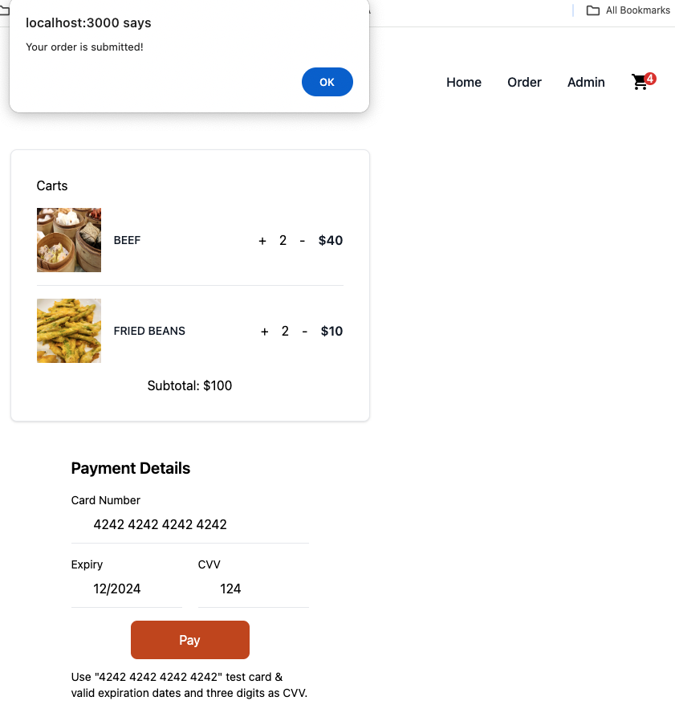
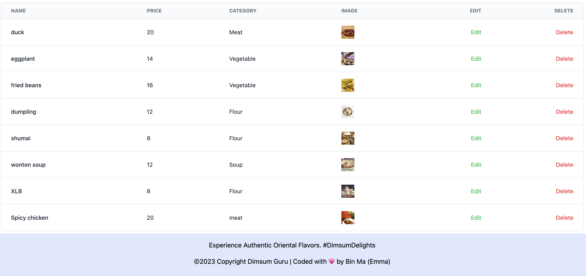

# DIMSUM GURU: Full Stack Food Ordering Platform

DIMSUM GURU is a robust, full-stack e-commerce platform designed specifically for online food ordering. Alongside a user-friendly customer interface, it also incorporates a powerful admin dashboard for efficient inventory management.

## Key Features

- **React Routing:** Efficient and intuitive page navigation.
- **Firebase Authentication (Non-Google):** Secure user data and ensure privacy.
- **LocalStorage:** Maintain user session and data persistence.
- **Tailwind CSS:** Implement modern and responsive designs.
- **PostgreSQL, Express & Node.JS:** Robust back-end to manage and process data.
- **Mobile-First Responsive Design:** Ensure the platform is accessible on all devices.

## A Glimpse into DIMSUM GURU

**Home Page**

 
**Menu Display**
Delight in our diverse range of dishes!

 
**Shopping Cart Page**
Review your order with ease!

 
**Admin Account**
Comprehensive CRUD functionality for efficient inventory tracking.

 
## Upcoming Enhancements

- **Stripe API Integration** 
- **Performance Optimizations** 
- **Deployment** 

Stay tuned for more updates!

