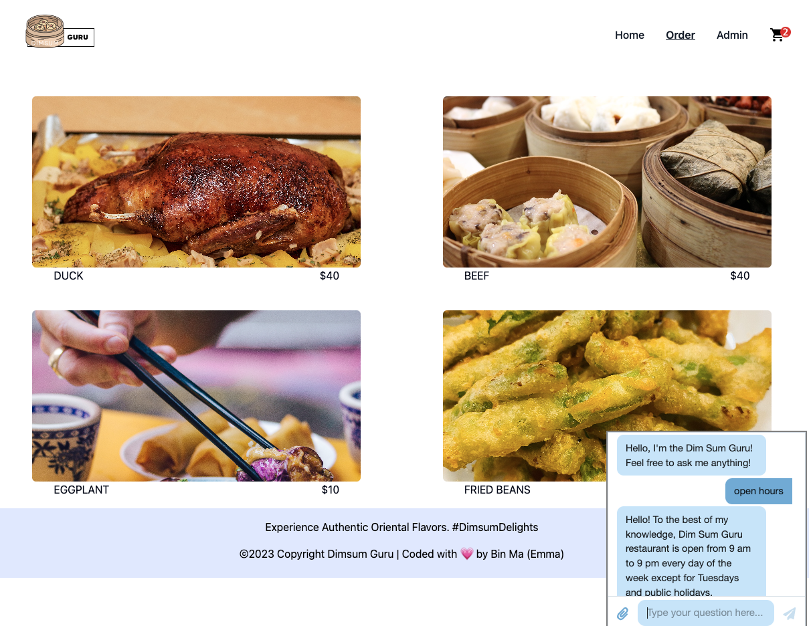

# DIM SUM GURU: Full Stack Food Ordering Platform

DIM SUM GURU is a full-stack e-commerce platform designed specifically for online food ordering. Alongside its user-friendly customer interface, it features an admin dashboard for efficient menu updates. Leveraging the power of the Cloudinary API and OpenAI, it delivers real-time assistance to enhance the user experience.

## Key Features

- **React Routing:** Efficient and intuitive page navigation.
- **OpenAI API:** Provides real-time customer service and offers predefined solutions to users.
- **Cloudinary API:** Addresses the challenge of converting image files to strings for storage in the database.
- **Redux:** Manage state value across components.
- **Firebase Authentication (Non-Google):** Secure admin data and ensure privacy.
- **LocalStorage:** Maintain user session and data persistence.
- **Tailwind CSS:** Implement modern and responsive designs.
- **PostgreSQL, Express & Node.JS:** Back-end to manage and process data.
- **Mobile-First Responsive Design:** Ensure the platform is accessible on all devices.

## A Glimpse into DIM SUM GURU

**Home Page**

 

**Menu Display**
Delight in our diverse range of dishes!

 
 

**Shopping Cart Page**
Review your order with ease!

 

**Admin Account**
Comprehensive CRUD functionality enables the owner to instantly update the menu

 

 

**Customer Service Chatbot**
Implemented an OpenAI chatbot to serve as customer service, providing information to users.

 

## Upcoming Enhancements

- **Stripe API Integration** 
- **Performance Optimizations** 
- **Deployment** 

Stay tuned for more updates!

